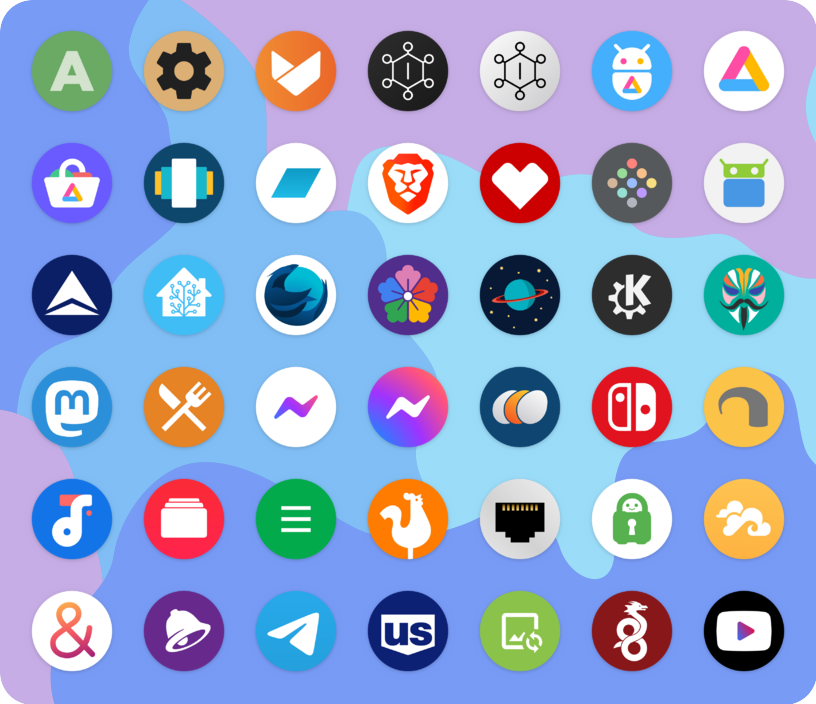

# app icons

Hand-made adaptive icons for a small selection of Android apps.

## why?

I like my app icons to all be circular in the app drawer. Sometimes they don't have circular/adaptive icons or sometimes it just looks ugly or not positioned/scaled right to me. These icons are mostly meant to supplement apps that don't already have adaptive icons; not every app needs a new icon.

## notes

I would like to turn this into an installable icon pack but I'm not an Android developer and I have no idea what I'm doing. Please help if you can!

Feel free to open an issue if you want me to make an icon and I may or may not decide to.

## contributing

Feel free to submit an icon through a pull request if you'd like! I don't stick to any specific design language but I try to follow these personal rules to keep them feeling cohesive:
- SVG format vector drawing.
- Follow [Google's adaptive icon guidelines](https://developer.android.com/google-play/resources/icon-design-specifications) and use the included `adaptive_template.svg` for scale and position. Use two layers: one for the background and one for the foreground.
- Use vector logo or redraw it as a vector. (NO EMBEDDED RASTER IMAGES PLS)
- If the source logo or icon looks too "busy", simplify it by reducing it to the essentials.
- No letters or text unless the letter is the logo (NOT the wordmark). (e.g. Facebook's 'f')
- No shadows.
- Gradients can be used but they should be tasteful and not too flashy.
- All colors should be sourced from the original icon, but exceptions can be made.

If an app's current icon doesn't follow these then it's probably a good candidate for this icon pack.

## to do

- [ ] Package it into an APK that you can install on your phone
- [x] Due to weird Inkscape behavior, make sure things that are supposed to be white are fully white
- [x] Update layer IDs so that the exported files are named `foreground.*` and `background.*`
- [x] Fix layers on Home Assistant and Popeyes icons

## license

[`CC BY-SA 4.0`](https://creativecommons.org/licenses/by-sa/4.0/)
