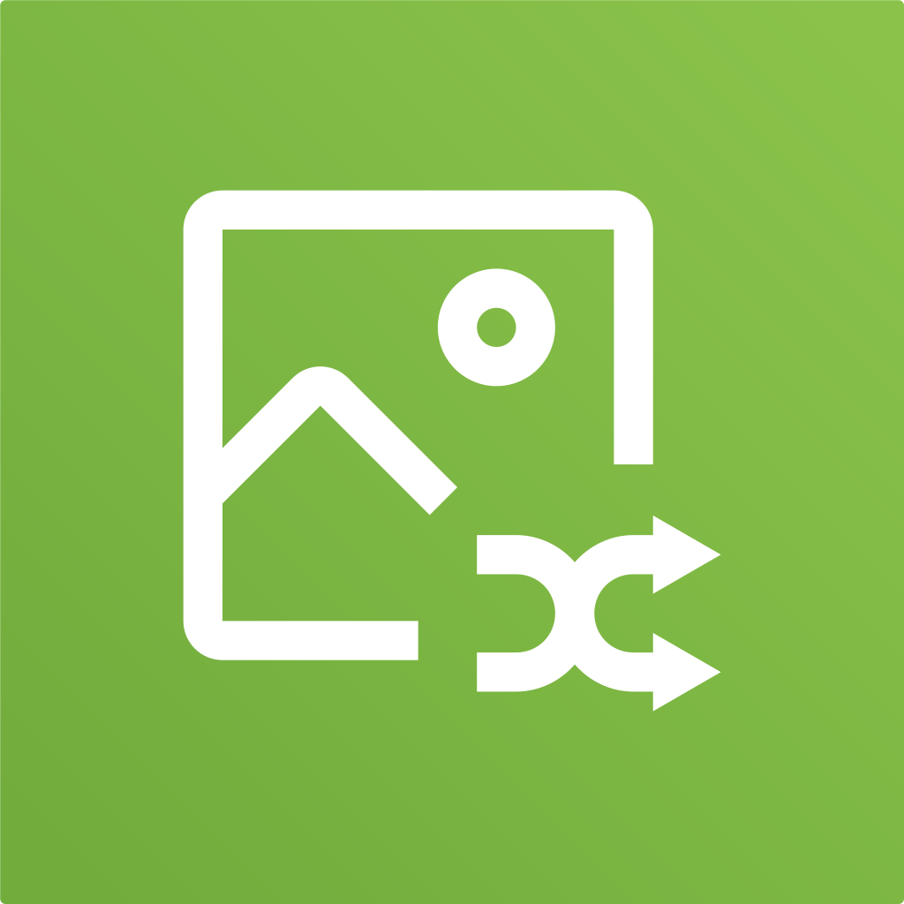

# app icons

Hand-made icons for a small selection of Android apps.

## the icons

## why?

I like my app icons to all be circular in the app drawer. Sometimes they don't have circular/adaptive icons or sometimes it just looks ugly. These icons are mostly meant to supplement apps that don't have adaptive icons; not every app needs a new one.

## notes

I'm planning to turn this into an installable icon pack, though I have very little experience with Android development so any help would be appreciated.

Feel free to open an issue if you want me to make an icon and I may or may not decide to.

## contributing

You are free to submit an icon through a pull request. I don't stick to any specific design language but I try to follow these personal rules to keep them cohesive:
- SVG format vector drawing.
- Follow [Google's adaptive icon guidelines](https://developer.android.com/google-play/resources/icon-design-specifications) for scale and position.
- Use vector logo or redraw it as a vector. (NO EMBEDDED RASTER IMAGES PLS)
- No letters or text unless the letter is the logo (NOT the wordmark). (e.g. Facebook)
- If the source logo or icon looks too "busy", simplify it by reducing it to the essentials.
- No shadows other than for the plate.
- Gradients can be used but they should be tasteful and not too flashy.
- All colors should be sourced from the original icon, but exceptions can be made.
If an app's current icon doesn't follow these then it's probably a good candidate for this icon pack.

## license

`CC0` (public domain)
