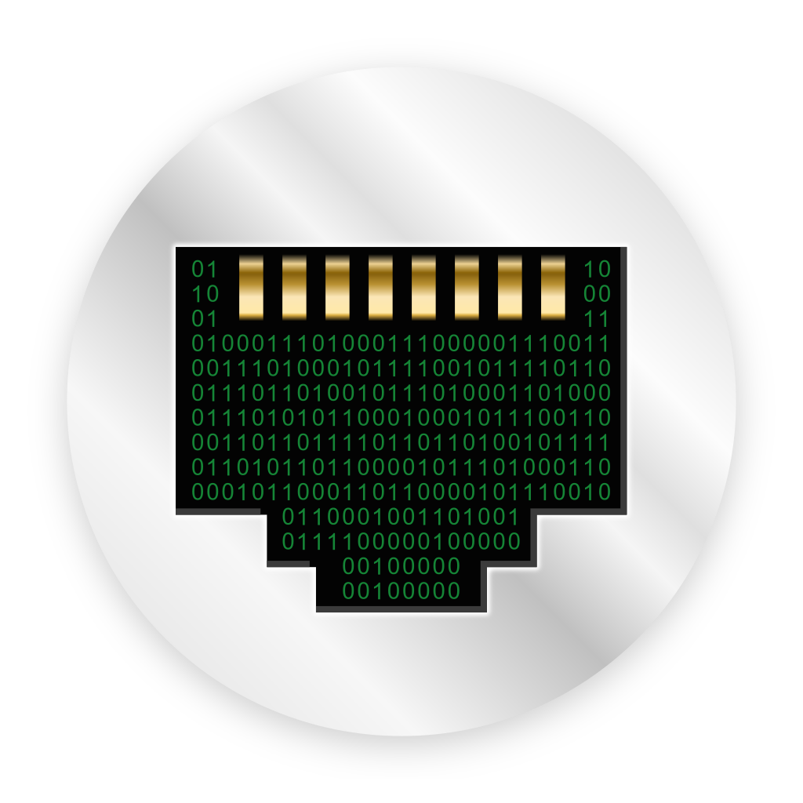

# app icons

Hand-made icons for a small selection of Android apps.

## the icons

## why?

I like my app icons to all be circular in the app drawer. Sometimes they don't have circular/adaptive icons or sometimes it just looks ugly.

## notes

If there's enough interest I may turn this into an installable icon pack. I have very little experience with Android development so any help would be appreciated.

Feel free to open an issue if you want me to make an icon and I may or may not decide to.

## license

`CC0` (public domain)
